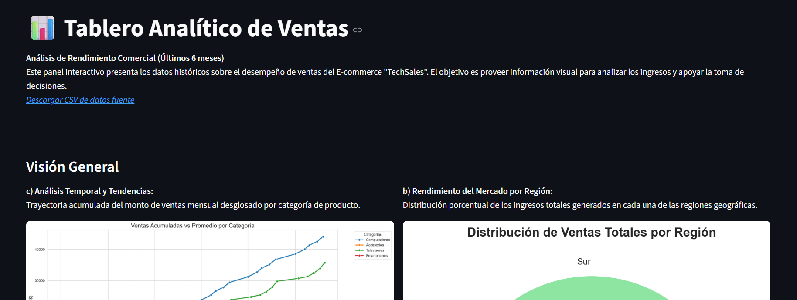
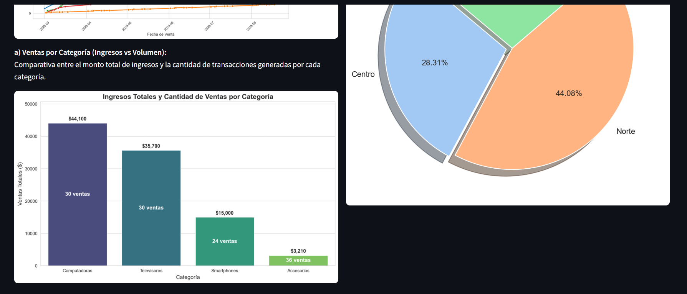
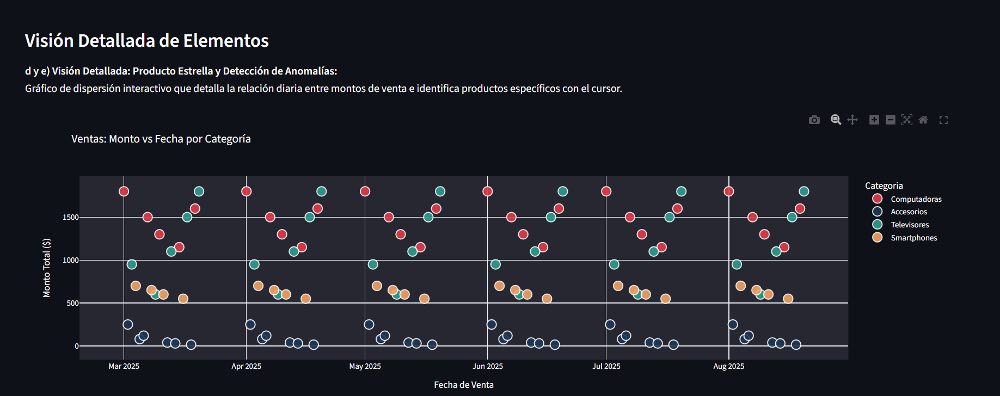

# 📊 TechSales Analytics Dashboard

Interactive sales dashboard built with **Python & Streamlit** to analyze the commercial performance of a TechSales e-commerce over its last 6 months of operation.

[](https://tablero-python-de-ventas-data-analysis-hrhe3mfneqcfdmzrqqvupe.streamlit.app/)

---

## 📸 Preview





---

## 🗂️ Project Structure

```
📁 Tablero Python de Ventas - Data Analysis/
├── Taller.py                                    # Main Streamlit application
├── Taller.ipynb                                 # Exploratory analysis notebook
├── Ventas TeachSales.csv                        # Source dataset (semicolon-separated)
├── Caso de Estudio E-commerce TechSales.pdf     # Case study document
├── requirements.txt                             # Python dependencies
└── README.md
```

> 📄 **`Caso de Estudio E-commerce TechSales.pdf`** contains the academic case study brief and context for this project.

---

## 📌 Dashboard Overview

The dashboard presents key visualizations on TechSales sales data, split into two main sections:

### General Overview

| Chart | Description |
|---|---|
| **a) Revenue vs Volume by Category** | Bar chart comparing total revenue and number of transactions per product category |
| **b) Market Performance by Region** | Pie chart showing the percentage of total revenue generated per geographic region |
| **c) Cumulative Sales Trend** | Line chart tracking accumulated sales over time, broken down by category |

### Detailed View

| Chart | Description |
|---|---|
| **d/e) Interactive Scatter Plot** | Plotly scatter plot (amount vs date) with product-level hover detail and visual anomaly detection |

---

## 🛠️ Tech Stack

| Library | Purpose |
|---|---|
| `streamlit` | Web dashboard framework |
| `pandas` | Data loading, cleaning and aggregation |
| `matplotlib` | Static chart rendering base |
| `seaborn` | Styled line and bar charts |
| `plotly.express` | Interactive scatter chart |

---

## ▶️ Run Locally

1. Install dependencies:

```bash
pip install -r requirements.txt
```

2. Make sure `Ventas TeachSales.csv` is in the same folder as `Taller.py`.

3. Launch the dashboard:

```bash
streamlit run Taller.py
```

---

## 📁 Dataset

The file `Ventas TeachSales.csv` contains the following columns:

| Column | Description |
|---|---|
| `Fecha` | Transaction date (DD/MM/YYYY format) |
| `Categoria` | Product category |
| `Producto` | Product name |
| `Monto_Venta` | Sale amount in USD |
| `Region` | Geographic region |

> **Separator:** `;` &nbsp;|&nbsp; **Encoding:** UTF-8
